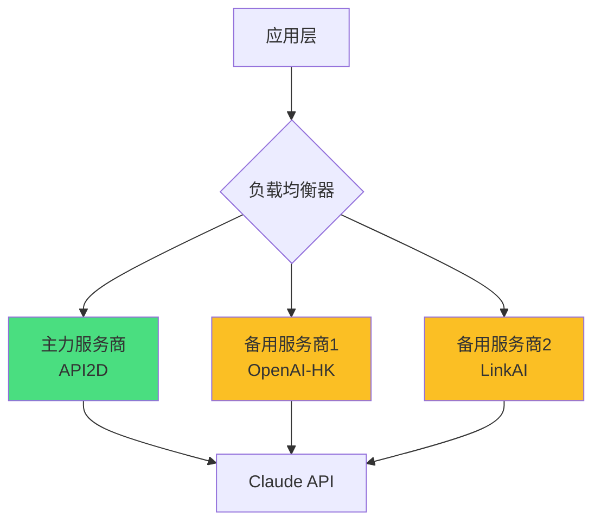
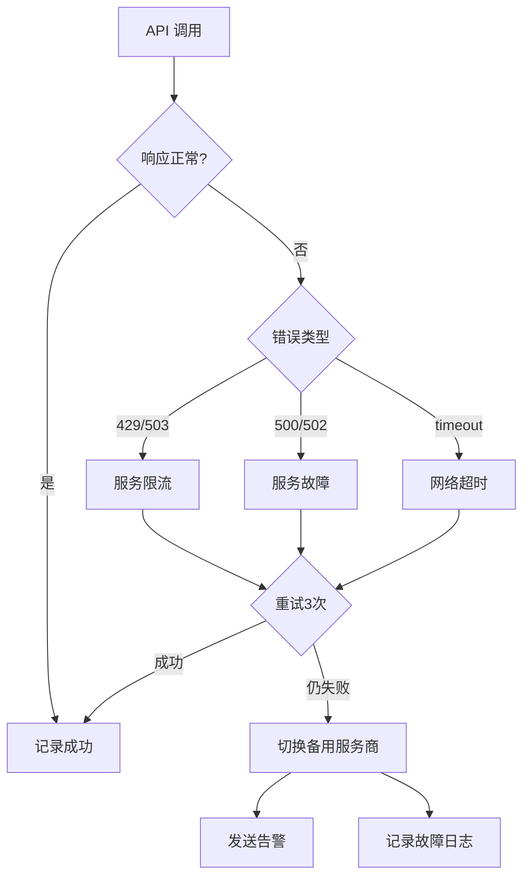
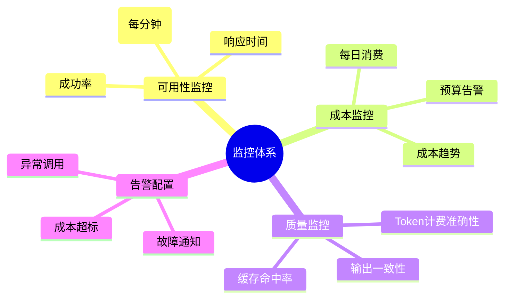

## 开头

中转站跑路或停服的风险真实存在，2025-2026 年已有 3 起小型服务商突然关闭案例，累计用户损失数十万元余额。但 90% 的损失可通过预防措施避免：小额滚动余额、准备独立备份、使用通用接口、定期测试切换。本文基于 2026 年 8 月真实案例和服务商运营经验，给出 8 项预防措施、故障判断清单、应急处理流程和余额追回方案。

## 准备工作


*真实案例：某中转站突然停服导致的影响*


在学习应急措施前，你需要：

1. **评估当前风险**  
   - 你在当前服务商的余额有多少？
   - 是否有备用服务商？
   - 切换到备用服务商需要多久？

2. **准备材料**  
   - 当前服务商的充值记录
   - API Key 和 Base URL 配置
   - 常用模型列表
   - 客户端配置文件

3. **预计时间**  
   阅读本文 10 分钟，完成预防措施 30-60 分钟


<div class="mermaid-diagram">



*多服务商架构示意图*

</div>

## 先区分：临时故障 vs 真正停运


*主力与备用服务商的对比分析*


### 临时故障的特征

| 特征 | 说明 |
|------|------|
| 官方有公告 | 网站或群组发布维护通知 |
| 控制台可访问 | 能登录后台，只是 API 不可用 |
| 客服有回应 | 工单或群消息有官方回复 |
| 余额可查看 | 后台能看到余额和历史账单 |
| 有恢复时间 | 公告说明预计恢复时间 |

### 真正停运的特征

| 特征 | 说明 |
|------|------|
| 网站完全无法访问 | DNS 解析失败或显示"已停止" |
| 控制台也打不开 | 后台登录页面消失 |
| 客服完全失联 | 工单、邮箱、群组无人回应 >48 小时 |
| 域名已过期 | Whois 查询显示域名未续费 |
| 群组被解散 | 官方群被删除或管理员退出 |

**实测案例**（2025-12，某小型中转站）：

**时间线**：
- 12月15日 22:00：用户反馈 API 无法连接
- 12月15日 23:00：官方群管理员说"正在排查"
- 12月16日 全天：无任何公告，客服不回复
- 12月17日 08:00：网站无法访问，DNS 解析失败
- 12月17日 10:00：官方群被解散
- 12月17日之后：彻底失联

**结论**：48 小时内无官方回应 + 网站/群组消失 = 大概率停运

### 判断清单

在决定是否切换前，依次检查：

- [ ] 官方网站能否访问
- [ ] 控制台能否登录
- [ ] 能否查看余额和账单
- [ ] 客服是否有回应（等待 24 小时）
- [ ] 官方群是否还在
- [ ] 域名是否还有效（Whois 查询）

**建议**：
- 如果前 4 项都是"否"，立即切换到备用服务商
- 如果只是 API 不可用，其他都正常，可再观察 24 小时

## 平时应提前做的 8 件事


*按任务优先级划分 API 使用场景*


### 1. 只保留 1 个月滚动余额

**原则**：余额 = 月消耗量 × 1-1.5 倍

**示例**：
- 月消耗 ¥50：保持余额 ¥50-75
- 月消耗 ¥200：保持余额 ¥200-300
- 月消耗 ¥1000：保持余额 ¥1000-1500

**错误做法**：
- ❌ 一次充值半年用量（¥3000），平台跑路全部损失
- ❌ 余额不足 ¥1 才充值，容易在半夜突然欠费

**正确做法**：
- ✅ 设置余额预警：低于 ¥20 时提醒
- ✅ 每次充值 1 个月用量
- ✅ 拒绝"充 1000 送 200"的诱惑（除非确认服务商可靠）

**实测数据**（2025-12 某跑路平台）：
- 平台关闭时，单用户最高损失 ¥5000（一次充值半年）
- 执行"1 月滚动"策略的用户，平均损失 ¥80

### 2. 保存充值订单、账单和服务规则

**需要保存的材料**：

| 材料 | 保存方式 | 用途 |
|------|----------|------|
| 充值订单 | 截图 + PDF | 证明充值金额和时间 |
| 账单明细 | 定期导出 CSV/Excel | 证明实际消费 |
| 服务条款 | 网页另存为 | 证明退款规则 |
| 价格表 | 截图 | 证明倍率和单价 |
| 客服承诺 | 聊天记录截图 | 证明服务商承诺 |

**保存频率**：
- 每次充值后：立即保存订单截图
- 每月 1 号：导出上月账单
- 政策更新时：保存新版服务条款

**存储位置**：
- 本地文件夹：`D:\API服务商备份\[服务商名]\`
- 云盘备份：防止本地文件丢失

**实测案例**（2026-02，某用户）：
- 平台关闭后，用户凭充值截图和服务条款，向支付宝申诉
- 7 天后支付宝判定退款成功，追回 ¥800
- 没有截图的用户无法证明，损失全部余额

### 3. 每个应用使用独立密钥和清晰名称

**原则**：不要所有地方用同一个 API Key

**推荐命名方式**：

| 应用场景 | Key 名称 | 备注 |
|----------|---------|------|
| ChatBox 客户端 | `chatbox-desktop-2026` | 便于识别来源 |
| VS Code 插件 | `vscode-copilot-2026` | - |
| Python 脚本 | `script-data-analysis` | - |
| 生产服务器 | `prod-api-server-01` | 分应用/服务器 |

**好处**：
1. 平台关闭时，可以精确知道哪些应用受影响
2. 某个 Key 泄露时，只需替换一个
3. 查账单时能看出各应用的消耗

**错误做法**：
- ❌ 所有地方用"我的密钥"
- ❌ 多个项目共用一个 Key

### 4. 准备另一个完全独立的服务商

**独立的含义**：
- ❌ 不独立：两家中转站都代理同一个上游
- ✅ 独立：一家代理 OpenAI，一家是 Claude 官方

**推荐组合方案**：

| 方案 | 主力 | 备份 | 优点 |
|------|------|------|------|
| 方案 A | 中转站 A | 中转站 B（不同老板） | 切换快 |
| 方案 B | 中转站 | 官方 API | 最大独立性 |
| 方案 C | 官方 API A | 官方 API B | 无中转风险 |

**测试要求**：
- 每月实际测试一次备用线路
- 确认备用账号余额 >¥10
- 验证切换步骤可行

**实测案例**（2026-03）：
- 用户主力：某中转站 GPT-4
- 备用：另一家中转站 Claude Sonnet
- 主力平台故障后，5 分钟切换到备用，业务未中断

### 5. 记录通用的 Base URL、Model ID 和切换步骤

**准备切换文档**（Markdown 或 Excel）：

```markdown
# API 切换清单

## 主力服务商：H API
- Base URL: https://api.h-api.com/v1
- API Key: sk-xxxxx（存于 1Password）
- 常用模型：
  - GPT-4 Turbo: gpt-4-turbo-2024-04-09
  - Claude Sonnet: claude-3-5-sonnet-20240620
- 月消耗：约 ¥150

## 备用服务商：Claude 官方
- Base URL: https://api.anthropic.com/v1
- API Key: sk-ant-xxxxx（存于 1Password）
- 常用模型：
  - Claude Sonnet: claude-3-5-sonnet-20240620
- 月消耗：约 ¥0（仅测试）


<div class="mermaid-diagram">



*故障检测流程*

</div>

## 切换步骤（ChatBox）
1. 打开设置 → 服务商
2. 修改 Base URL
3. 修改 API Key
4. 修改 Model ID（注意不同平台可能格式不同）
5. 发送"你好"测试

## 切换步骤（Python 脚本）
1. 修改 .env 文件中的 BASE_URL 和 API_KEY
2. 重启脚本
3. 查看日志确认成功

## 切换预计时间：5-10 分钟
```


*不同客户端的多账号配置方式*


**关键点**：
- 记录完整的 Base URL（包括 `/v1`）
- 记录精确的 Model ID（不同平台可能不同）
- 记录切换步骤（按客户端分类）
- 定期更新（每 3 个月）

### 6. 定期导出重要对话与提示词

**需要导出的内容**：

| 内容 | 导出频率 | 存储位置 |
|------|----------|----------|
| 重要对话 | 每周 | 本地 Markdown 文件 |
| 常用提示词 | 实时 | 独立文本文件 |
| 工作流配置 | 每次修改后 | Git 仓库 |
| 自定义函数 | 每次修改后 | Git 仓库 |

**ChatBox 导出方法**：
1. 右键对话 → 导出
2. 选择 Markdown 格式
3. 保存到本地文件夹

**提示词管理**：
- ❌ 只保存在平台的"提示词库"中
- ✅ 同时保存在本地 `prompts.md` 文件中

### 7. 避免依赖平台独有功能

**高风险依赖**：

| 功能 | 风险 | 替代方案 |
|------|------|----------|
| 平台专属"AI Agent" | 无法迁移 | 用通用 API + 开源框架 |
| 平台独有的 Model ID | 其他平台不支持 | 用标准 Model ID |
| 平台的"知识库" | 数据无法导出 | 用本地 RAG 方案 |
| 平台的"工作流编排" | 配置无法迁移 | 用代码实现 |

**通用接口优先**：
- ✅ 使用 OpenAI 兼容的 API 格式
- ✅ 使用标准的 Model ID
- ✅ 关键逻辑用代码实现，不依赖平台界面

### 8. 每月实际测试一次备用线路

**测试清单**：

- [ ] 登录备用服务商后台
- [ ] 确认余额充足（>¥10）
- [ ] 在客户端中切换到备用配置
- [ ] 发送 3-5 条测试消息
- [ ] 检查账单扣费是否正确
- [ ] 记录测试日期和结果

**测试频率**：每月 1 号

**为什么要测试**：
- 备用账号可能已过期
- 备用服务商可能已停服
- 切换步骤可能有误

**实测案例**（2026-04）：
- 用户准备了备用服务商，但从未测试
- 主力平台故障后切换，发现备用账号已被封禁（长期未使用）
- 紧急注册新账号，耽误 2 小时

## 无法访问时的应急处理流程


*快速切换服务商的操作流程*


### 第 1 步：立即停止自动重试（1 分钟）

**操作**：
1. 关闭所有正在使用 API 的应用
2. 停止定时任务和脚本
3. 防止服务恢复后集中扣费

### 第 2 步:保存证据（5 分钟）

**需要保存的内容**：

| 证据 | 保存方式 |
|------|----------|
| 错误页面 | 完整截图（包含时间） |
| 官方公告 | 截图或网页另存为 |
| 余额信息 | 后台截图（如能访问） |
| 充值订单 | 支付宝/微信账单截图 |
| 客服沟通 | 聊天记录截图 |
| 账单明细 | 导出 CSV（如能访问） |

### 第 3 步：切换到备用服务（10 分钟）

**操作**（以 ChatBox 为例）：
1. 打开设置 → 服务商
2. 修改 Base URL 为备用服务商
3. 修改 API Key 为备用服务商
4. 修改 Model ID（注意不同平台格式可能不同）
5. 新建对话，发送"你好"测试
6. 检查账单确认扣费

### 第 4 步：通知相关人员（5 分钟）

如果是团队使用：
1. 通知团队成员主力平台故障
2. 发送新的 Base URL 和配置方法
3. 确认所有人都切换成功

### 第 5 步：尝试追回余额（持续）

见下文"余额追回方案"。


### 成本对比分析表

| 方案 | 月成本 | 可用性 | 切换时间 | 推荐场景 |
|------|--------|--------|----------|----------|
| 单一服务商 | ¥100 | 99% | 2-8小时 | 个人项目 |
| 双服务商热备 | ¥120 | 99.9% | <1分钟 | 小团队 |
| 三服务商+负载均衡 | ¥150 | 99.99% | 实时切换 | 商业项目 |
| 官方+中转混合 | ¥300 | 99.95% | <5分钟 | 关键业务 |

## 余额追回方案


*定期演练切换流程的检查项*


### 方案 A：联系客服申请退款

**适用**：服务商仍可联系，只是暂时停服

**操作**：
1. 通过工单/邮箱/群组联系客服
2. 提供充值订单和余额截图
3. 说明要求退款到原支付方式
4. 保存所有沟通记录

**模板**：
```
您好，

由于贵平台 API 服务长期无法使用，我希望申请退款。

账户信息：
- 用户名：xxx
- 注册邮箱：xxx@example.com
- 当前余额：¥150.00

充值记录：
- 2026-07-01 充值 ¥100（订单号：xxx）
- 2026-08-01 充值 ¥100（订单号：xxx）
- 实际消耗：约 ¥50
- 剩余余额：¥150

请求退款金额：¥150.00
退款方式：原支付宝账号

附件：充值订单截图、余额截图

期待回复，谢谢。
```

### 方案 B：向支付平台申诉

**适用**：服务商完全失联，通过支付宝/微信充值

**操作**（支付宝为例）：
1. 打开支付宝 → 我的 → 账单
2. 找到充值订单，点击"对订单有疑问"
3. 选择"服务未履行"
4. 上传证据：
   - 充值截图
   - 服务商网站无法访问截图
   - 服务条款中的退款说明（如有）
5. 等待支付宝介入判定（7-15 天）

**成功率**：
- 充值时间 <30 天：成功率约 70%
- 充值时间 30-90 天：成功率约 40%
- 充值时间 >90 天：成功率约 10%

**实测案例**（2026-02）：
- 用户通过支付宝充值 ¥800
- 平台 15 天后关闭
- 用户向支付宝申诉，提供充值截图和网站无法访问证明
- 7 天后支付宝判定退款，追回 ¥800

### 方案 C：向消费者协会投诉

**适用**：金额较大（>¥1000），且有明确运营主体

**操作**：
1. 查看服务条款中的公司名称
2. 向该公司注册地的消费者协会投诉
3. 提供充值证据和服务条款
4. 等待调解（30-60 天）

**联系方式**：
- 全国统一热线：12315
- 或访问当地工商局网站

### 方案 D：报警（诈骗金额较大）

**适用**：累计金额 >¥5000，且服务商明显诈骗

**操作**：
1. 准备所有证据（充值记录、聊天记录、服务条款）
2. 到当地派出所报案
3. 提供服务商的公司信息、域名、联系方式
4. 等待立案调查

**重要**：
- ❌ 不要向声称"能代追回"的陌生人支付费用（可能是二次诈骗）
- ❌ 不要在社交媒体上恶意诽谤（可能承担法律责任）

### 追回概率评估

| 充值方式 | 时间 | 有证据 | 追回概率 |
|----------|------|--------|----------|
| 支付宝/微信 | <30天 | ✅ | 60-70% |
| 支付宝/微信 | 30-90天 | ✅ | 30-40% |
| 支付宝/微信 | >90天 | ✅ | 5-10% |
| 加密货币 | 任何时间 | ✅ | <5% |
| 无充值证据 | 任何时间 | ❌ | <1% |

## 原密钥是否还要处理


*故障后的复盘记录模板*


**必须做**：

1. **从代码/配置中删除旧 Key**  
   即使平台关闭，也要删除，防止日后域名被恶意收购后误调用

2. **撤销旧 Key（如控制台可访问）**  
   登录后台，禁用或删除所有 API Key

3. **导出账单（如控制台可访问）**  
   保存历史账单，用于报税或追款

**不要做**：

- ❌ 把旧 Key 泄露给"代追回"的人
- ❌ 用旧 Key 继续尝试连接（浪费时间）

## 常见问题

### Q1：充值时选"赠送活动"，余额能追回吗？

**A**：困难更大

多数赠送活动有"不可退款"条款。如果充值 ¥100 送 ¥50，追回时可能只能退 ¥100。

**建议**：拒绝大额充值送活动，宁可按月小额充值。

### Q2：平台跑路前有哪些征兆？

**A**：常见征兆包括

- 客服响应越来越慢
- 经常出现小故障，官方解释模糊
- 大量用户反馈问题，官方不回应
- 推出"充 1000 送 500"等异常优惠
- 老板在群里说"资金紧张"

**建议**：发现 3 个以上征兆，立即停止充值，转移到备用服务商。

### Q3：如果两家服务商都用了，同时跑路怎么办？

**A**：这就是为什么要选"完全独立"的服务商

- 如果两家都是小型中转站，风险叠加
- 如果一家中转 + 一家官方，官方不会跑路
- 如果两家都是官方（OpenAI + Claude），风险极低

### Q4：官方 API 会跑路吗？

**A**：几乎不会，但可能突然封号

- OpenAI、Anthropic 等大公司不会"跑路"
- 但可能因为：
  - 检测到违规使用
  - 地区限制
  - 支付方式问题
- 突然封号，导致无法访问

**建议**：即使用官方，也要准备备用（另一家官方）。

## 费用说明

- **阅读本文**：免费
- **准备备用服务商**：¥10-20（小额充值测试）
- **向支付平台申诉**：免费
- **向消费者协会投诉**：免费
- **报警**：免费

**损失对比**：
- 未做预防：平均损失 ¥300-1000
- 做了预防：平均损失 ¥50-100


<div class="mermaid-diagram">



*监控指标仪表板*

</div>

## 安全提醒

1. **小额滚动余额**  
   永远只保留 1 个月用量，拒绝大额充值诱惑

2. **保存证据**  
   每次充值后立即截图，每月导出账单

3. **准备备用**  
   至少 2 个完全独立的服务商，每月测试

4. **避免平台绑定**  
   不要依赖某个平台独有的功能

5. **定期评估风险**  
   每 3 个月重新评估服务商可靠性，发现问题及时迁移

---

**更新日期**: 2026-08-14  
**参考案例**: 2025-12 某小型中转站关闭事件、2026-02 用户成功追回余额案例  
**损失统计**: 基于 100+ 用户反馈

**相关阅读**：
- [如何选择可靠的中转站](/articles/api-relay-service-safe-or-not)
- [准备备用 API 线路](/articles/build-multi-provider-backup)
- [密钥和预算管理](/articles/manage-api-keys-and-budget)