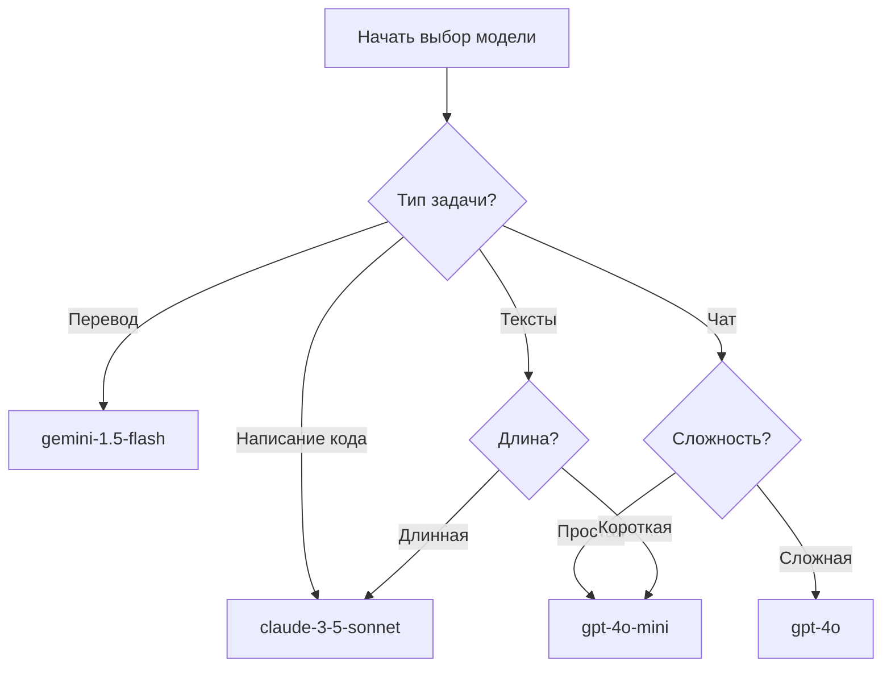

Выбор правильной модели может сэкономить половину расходов. Не все задачи требуют самой дорогой модели.

## Основной принцип

**Для простых задач используйте дешевые модели, для сложных — дорогие.**

Сравнение цен (за миллион токенов):
- `gpt-4o-mini`: 0.3 юаня
- `gpt-4o`: 15 юаней
- `claude-3-5-sonnet`: 18 юаней

Разница в 50 раз, но для многих задач достаточно дешевых моделей.

---

## Выбор модели по типу задачи

### 1. Написание кода

**Рекомендуемая модель**: `claude-3-5-sonnet-20241022`

**Почему**:
- Точное автодополнение кода
- Сильное понимание контекста
- Хорошая читаемость сгенерированного кода

**Альтернативы**:
- `gpt-4o` (второй выбор)
- `deepseek-chat` (дешевле, но качество ниже)

**Не рекомендуется**:
- `gpt-4o-mini` (нестабильное качество кода)
- `gemini-1.5-flash` (склонна к ошибкам)

**Сравнение цен**:

| Модель | Стоимость за вызов | Применение |
|------|------------|---------|
| claude-3-5-sonnet | 0.18 юаня | Сложные алгоритмы, крупные проекты |
| gpt-4o | 0.15 юаня | Код средней сложности |
| deepseek-chat | 0.02 юаня | Простые скрипты, обучение |

---

### 2. Перевод

**Рекомендуемая модель**: `gemini-1.5-flash`

**Почему**:
- Хорошая поддержка многих языков
- Низкая цена
- Высокая скорость

**Альтернативы**:
- `gpt-4o-mini` (английский перевод)
- `gpt-4o` (профессиональные документы)

**Сравнение стоимости**:

Перевод статьи в 2000 слов:
- `gemini-1.5-flash`: 0.01 юаня
- `gpt-4o-mini`: 0.02 юаня
- `gpt-4o`: 0.3 юаня

С Gemini Flash экономия в 30 раз.

---

### 3. Повседневный чат

**Рекомендуемая модель**: `gpt-4o-mini`

**Почему**:
- Низкая цена
- Быстрые ответы
- Достаточно для обычного общения

**Когда обновляться**:
- Нужны сложные рассуждения
- Требуется понимание длинного текста
- Нужны знания в специализированной области

В этих случаях используйте `gpt-4o` или `claude-3-5-sonnet`.

**Сравнение ежедневных затрат**:

20 диалогов в день:
- `gpt-4o-mini`: 0.5 юаня
- `gpt-4o`: 5 юаней

Разница в 10 раз.

---

### 4. Написание текстов

**Рекомендуемая модель**: `gpt-4o`

**Почему**:
- Естественный стиль письма
- Хорошая креативность
- Точное понимание требований

**Выбор по длине**:

| Задача | Рекомендуемая модель | Причина |
|------|---------|------|
| Короткий текст (<100 слов) | gpt-4o-mini | Достаточно и дешево |
| Средний текст (500 слов) | gpt-4o | Стабильное качество |
| Длинный текст (2000+ слов) | claude-3-5-sonnet | Сильная логика |

---

### 5. Анализ данных

**Рекомендуемая модель**: `gpt-4o`

**Почему**:
- Понимает структурированные данные
- Может генерировать аналитические отчеты
- Поддерживает многошаговые рассуждения

**Сравнение стоимости**:

Анализ Excel-файла со 100 строками:
- `gpt-4o-mini`: 0.05 юаня (точность 70%)
- `gpt-4o`: 0.2 юаня (точность 95%)

Доплата 0.15 юаня повышает точность на 25%.

---

### 6. Резюмирование и извлечение

**Рекомендуемая модель**: `claude-3-5-sonnet-20241022`

**Почему**:
- Сильная обработка длинных текстов
- Точное выделение ключевых моментов
- Хороший структурированный вывод

**Применение**:
- Резюмирование протоколов встреч
- Извлечение резюме статей
- Внимательное чтение длинных документов

**Альтернативы**:
- Короткий текст (<1000 слов): `gpt-4o-mini`
- Средняя длина: `gpt-4o`

---

## Стратегия смешанного использования

**Самый экономичный способ: разные модели для разных задач.**

### Пример: написание технической статьи

**Шаг 1: План**
- Используйте `gpt-4o-mini` для генерации плана
- Стоимость: 0.01 юаня

**Шаг 2: Основной текст**
- Используйте `gpt-4o` для расширения содержания
- Стоимость: 0.3 юаня

**Шаг 3: Полировка**
- Используйте `claude-3-5-sonnet` для оптимизации выражений
- Стоимость: 0.2 юаня

**Общая стоимость**: 0.51 юаня

Если использовать только `claude-3-5-sonnet`: 1.2 юаня (более чем в два раза дороже)

---

## Сравнение характеристик моделей

| Модель | Лучше всего для | Не подходит для | Цена |
|------|--------|--------|------|
| gpt-4o-mini | Повседневный чат, простой перевод | Сложные рассуждения, код | Дешево |
| gpt-4o | Тексты, анализ данных, универсальные задачи | Очень длинные тексты | Средняя |
| claude-3-5-sonnet | Написание кода, резюмирование длинных текстов | Актуальная информация | Дорого |
| gemini-1.5-flash | Перевод, быстрый отклик | Сложные рассуждения | Дешево |
| deepseek-chat | Простой код, обучение | Специализированные области | Самая дешевая |

---

## Распространенные ошибки использования

### Ошибка 1: Использование самой дорогой модели для всех задач

**Пример**:
- Вопрос «какая погода сегодня» с `claude-3-5-sonnet`
- Каждый раз 0.1 юаня, хотя 0.005 юаня достаточно

**Правильный подход**:
- Простые вопросы: `gpt-4o-mini`
- Сложные задачи: обновление модели

---

### Ошибка 2: Использование только дешевых моделей для экономии

**Пример**:
- Написание сложного кода с `gpt-4o-mini`
- Результат: много ошибок в коде, многократные исправления
- Потеря времени и денег

**Правильный подход**:
- Для сложных задач сразу используйте хорошую модель
- Сделать правильно с первого раза экономнее

---

### Ошибка 3: Выбор без проверки результатов

**Пример**:
- Услышали, что модель дешевая, и постоянно её используют
- Обнаружили низкое качество вывода
- Приходится переделывать с другой моделью

**Правильный подход**:
- Для новой задачи сначала протестируйте небольшую выборку
- Сравните эффективность нескольких моделей
- Выберите оптимальное соотношение цена/качество

---

## Дерево решений для выбора модели

---

## Практические советы

### 1. Установите модель по умолчанию

Повседневное использование:
- По умолчанию: `gpt-4o-mini`
- Для важных задач вручную переключайтесь на `gpt-4o` или `claude-3-5-sonnet`

Это автоматически экономит деньги.

---

### 2. Тестирование пакетных задач

Перед обработкой 100 задач перевода:
1. Сначала протестируйте 5 с `gemini-1.5-flash`
2. Если качество достаточное, используйте её для всех
3. Если недостаточно, обновите до `gpt-4o-mini`

Тестирование перед пакетной обработкой избегает потерь.

---

### 3. Мониторинг затрат

Регулярно проверяйте:
- Какую модель используете чаще всего
- Есть ли более дешевые альтернативы
- Можно ли оптимизировать стратегию использования

Справка: [Как отслеживать использование API](/articles/track-api-usage-and-cost)

---

## Резюме

**3 принципа выбора модели**:

1. **Для простых задач используйте дешевые**
   - Повседневный чат: `gpt-4o-mini`
   - Перевод: `gemini-1.5-flash`

2. **Для сложных задач используйте хорошие**
   - Написание кода: `claude-3-5-sonnet`
   - Анализ данных: `gpt-4o`

3. **При сомнениях сначала тестируйте**
   - Небольшая выборка с несколькими моделями
   - Выберите оптимальное соотношение цена/качество

Выбирая правильную модель для каждого сценария, можно сэкономить половину расходов.

---

**Тестовая информация**: Эта статья основана на сравнении производительности и цен основных моделей в августе 2026 года.
